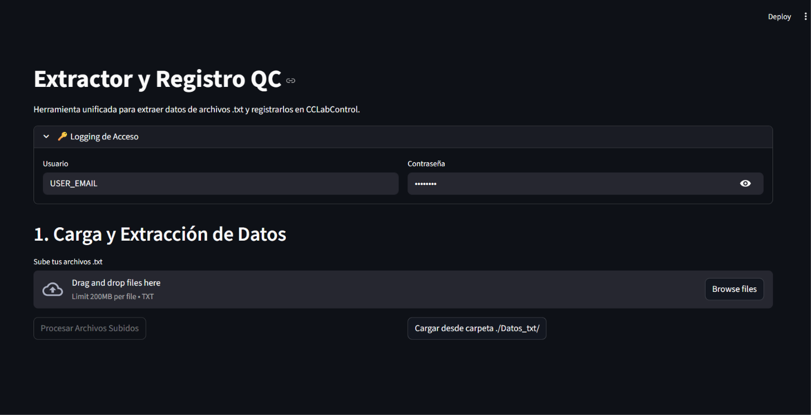
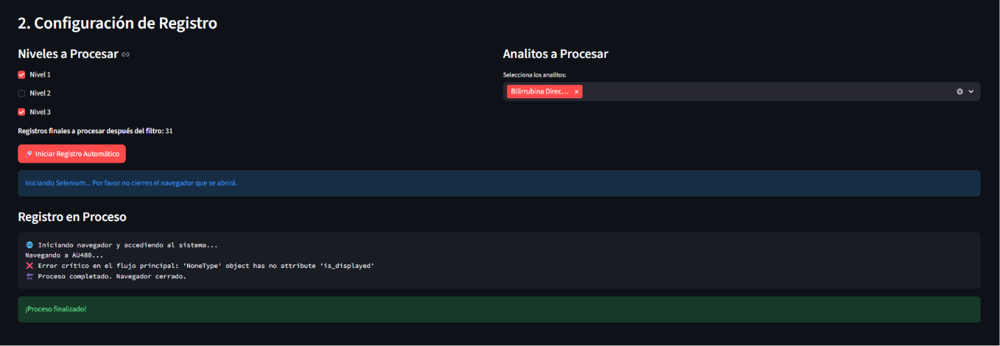
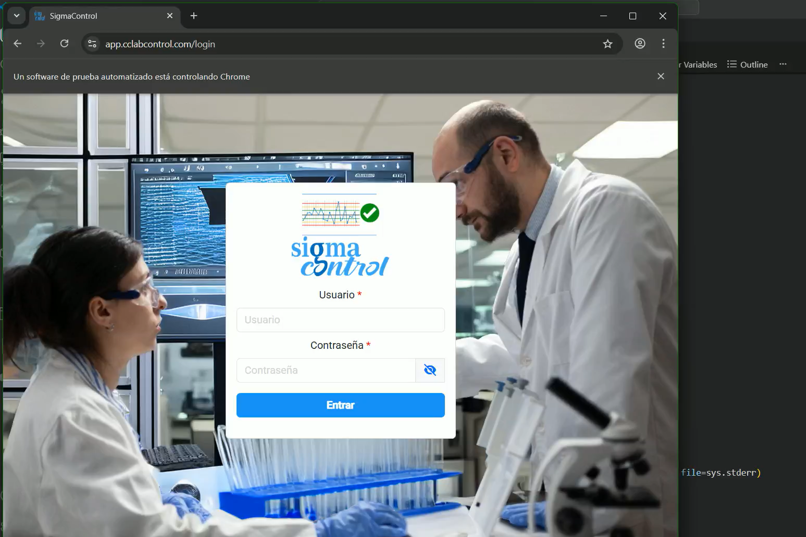
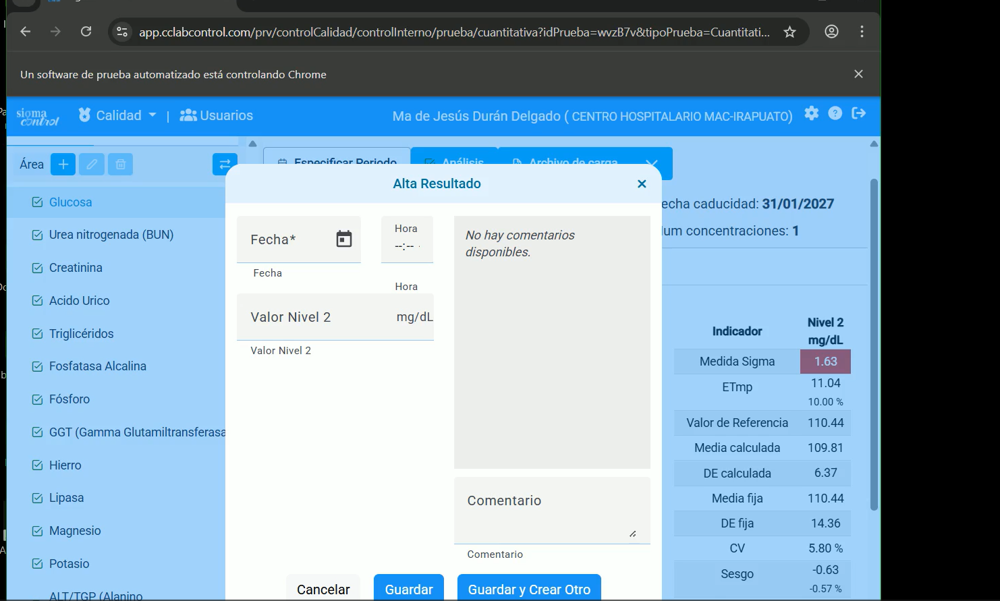

# 🔬 KPI Data Quality Laboratory: Extractor y Registro QC


Herramienta unificada y automatizada basada en **Python** y **Streamlit** diseñada para extraer, procesar y registrar datos de control de calidad (QC) desde analizadores clínicos (ej. AU480) hacia el sistema de gestión **CCLabControl**.

Esta solución implementa un pipeline de datos automatizado (extracción de texto estructurado → limpieza → resolución de conflictos → registro web vía Selenium) para optimizar el monitoreo de métricas de desempeño del laboratorio, reduciendo horas de trabajo y eliminando errores derivados de la carga manual.

---

## ✨ Características Principales

- **Interfaz de Usuario Intuitiva**: Construida con Streamlit, facilita la carga masiva de archivos `.txt` o el procesamiento por lotes desde un directorio local.
- **Extracción Inteligente de Datos**: Parsea archivos de texto sin formato, identificando fechas y bloques de resultados (`LYPHOCHEK-ASSAYED`), mapeando códigos de instrumentos a analitos estandarizados (Glucosa, Colesterol, Albúmina, etc.).
- **Resolución de Duplicados**: Sistema robusto de validación que detecta múltiples archivos para una misma fecha y sugiere automáticamente el documento con mayor integridad de datos (menor cantidad de valores nulos o en 0).
- **Automatización de Registro (RPA)**: Integra Selenium WebDriver para iniciar sesión y registrar de forma autónoma los valores consolidados en la plataforma web CCLabControl en los distintos niveles de control (Niveles 1, 2 y 3).
- **Filtros Personalizados**: Permite al usuario seleccionar qué analitos específicos y qué niveles procesar antes de iniciar la ejecución de registro.

---

## 🎥 Demostración del Proceso Automatizado

A continuación se muestra el funcionamiento automatizado completo (Pipeline de UI y automatización Selenium):

https://github.com/user-attachments/assets/70384b12-c8ab-4a62-a24d-8307436aac72

*(Video alternativo del flujo completo: [Kpi_post_automatización.mp4](./media/Kpi_post_automatización.mp4))*

---

## 📸 Interfaz de la Aplicación

### 1. Acceso Seguro (Logging)
Control de acceso integrado para ingresar credenciales de forma segura antes de iniciar procesos RPA.


### 2. Extracción y Consolidación de Datos
El sistema extrae los datos, resuelve posibles conflictos por fechas duplicadas y presenta una tabla interactiva consolidada lista para su revisión.


### 3. Configuración de Registro
Selección detallada de Niveles (1, 2, 3) y Analitos objetivo, otorgando control y flexibilidad operativa según las necesidades del día.


### 4. Ejecución del Registro Automático
Monitoreo en tiempo real de los logs de estado mientras el proceso Selenium se ejecuta en segundo plano.


---

## ⚙️ Arquitectura del Proyecto

El sistema se compone de tres módulos principales:

- **`app.py`**: El frontend interactivo creado en Streamlit. Maneja la lógica de presentación, estado de la sesión, carga de archivos y captura de preferencias del usuario.
- **`extractor_logic.py`**: Motor de parsing y extracción de información. Emplea expresiones regulares (`re`) y `pandas` para buscar patrones dentro del texto en bruto, estructurar los valores y organizar los resultados en DataFrames procesables.
- **`registro_logic.py`**: Motor de automatización RPA. Utiliza `selenium` para interactuar con el DOM de la aplicación web de laboratorio, realizando el inicio de sesión y el envío secuencial e iterativo de formularios con los datos del DataFrame final.

---

## 🚀 Instalación y Uso

### Prerrequisitos
- Python 3.8 o superior
- Google Chrome y el [ChromeDriver](https://chromedriver.chromium.org/downloads) correspondiente (o un WebDriver compatible con Selenium)

### Pasos de Configuración

1. **Clonar el repositorio**:
   ```bash
   git clone <url-del-repositorio>
   cd KPI_data_quality_laboratory
   ```

2. **Instalar dependencias**:
   ```bash
   pip install -r requirements.txt
   ```

3. **Configurar Variables de Entorno**:
   Crea un archivo `.env` en el directorio raíz con las credenciales de acceso para CCLabControl:
   ```env
   USER_EMAIL=tu_correo@ejemplo.com
   PASSWORD=tu_contraseña
   ```

4. **Ejecutar la aplicación**:
   ```bash
   streamlit run app.py
   ```
   *La aplicación se abrirá automáticamente en tu navegador por defecto (usualmente en `http://localhost:8501`).*

---

## 🛠️ Tecnologías Utilizadas

- **Frontend / Framework de Datos**: [Streamlit](https://streamlit.io/)
- **Procesamiento y Manipulación de Datos**: [Pandas](https://pandas.pydata.org/)
- **Automatización Web (RPA)**: [Selenium WebDriver](https://www.selenium.dev/)
- **Gestión de Entorno**: `python-dotenv`
